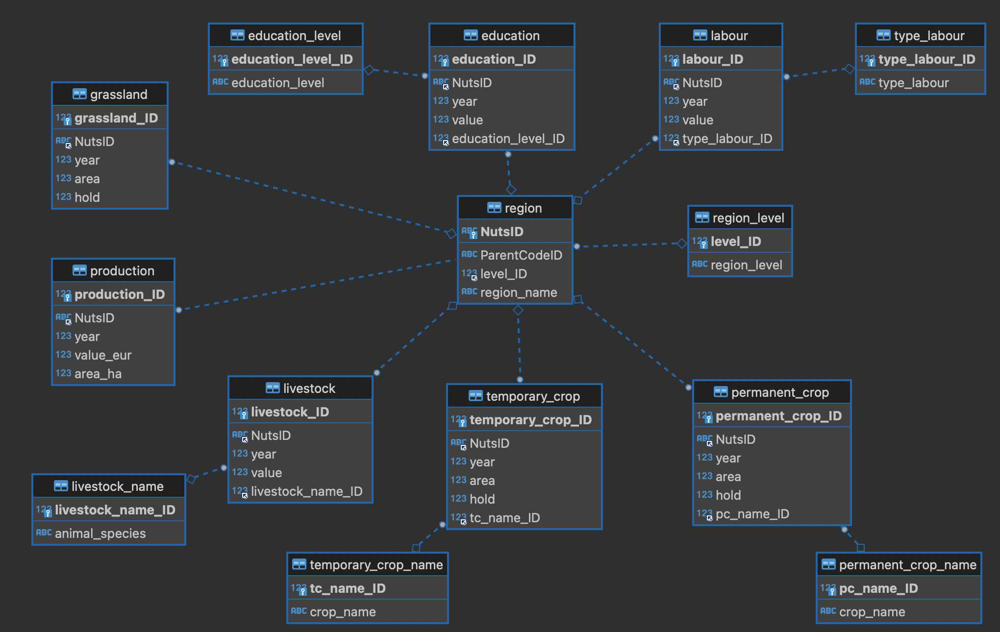

# Data Management and Storage

# Exercise 12 - Working with multiple tables

The goal of this exercise is to make DML queries using multiple tables. After the 
normalization process, obtaining meaningful data from the database normally will 
require joining data from more than one table. We will use the clause **JOIN**,
in its different forms (**INNER, LEFT, RIGHT**) to get the result sets that will
allow to respond to several questions.

The ultimate goal is to obtain the tables necessary to build the dashboard of the 
[Agricultural Census](https://www.ine.pt/scripts/db_ra_2019.html).


## Preparation of the exercise

This exercise can be run at the MySQL command line or in DBeaver.

It assumes that you have your database fully normalized, as a result of the successful
completion of DMS exercise 11. If you are uncertain that the database it in good
state, you can download +https://github.com/isa-ulisboa/greends-dms-exercises/blob/main/data/dms_INE_v2.sql.zip, 
unzip it and import to your database in the operating system terminal with the command
```
$ mysql -u dms_user -p dms_INE < dms_INE_v2.sql
```  

## ER diagram of the database

The Entity-Relationship diagram of the normalized database below is useful to 
identify the relationships, helping to remember the joins needed to obtain the
relevant data

.

The metadata information about the tables is the following

| Table name | Description |
|------------|-------------|
| region  | list of regions |
| region_level | level of region (according to NUTS classification |
| education | number of familiar agricultural population per level of education |
| education_level | level of education |
| labour | agricultural labour force in annual working units |
| type_labour | type of labour force |
| production | value of total standard production (€) of agricultural holdings and average value of total standard output by hectare of utilised agricultural area (€/ ha) |
 | grassland | area of permanent grassland and meadow (ha) and number of agricultural holdings with permanent grassland and meadow |
 | livestock | number of livestock animals in agricultural holdings |
 | livestock_name | name of the animal species |
 | permanent_crop | area of permanent crops (ha) and number of agricultural holdings with permanent crops |
 | permanent_crop_name | name of the permanent crop |
 | temporary_crop | area of temporary crops (ha) and number of agricultural holdings with temporary crops |
| temporary_crop_name | name of the temporary crop |


 The unit of report is the region (geographic unit).

## 1. Implicit JOINS

1. *Obtain the values of total standard production per NUTS2 for the year 2019.*

To obtain the requested values, we need tha tables **production**, **region** and **region_level**.
 The statement would be like this, in the form of implicit JOIN:
```
 SELECT
	r.region_name , p.value_eur 
FROM
	production p,
	region r,
	region_level rl
WHERE
	p.NutsID = r.NutsID
	AND r.level_ID = rl.level_ID 
	AND rl.region_level = 'NUTS2'
	AND p.`year` = 2019;
```
You should get the following result:
| region_name                 |value_eur |
|----------------------------|----------|
| Norte                       |1312536063|
| Algarve                     | 373196278|
| Centro                      |1786415564|
| Área Metropolitana de Lisboa| 313163976|
| Alentejo                    |2441935279|
| Região Autónoma dos Açores  | 423978604|
| Região Autónoma da Madeira  | 107140853|

Note the use of *aliases* for the name of the tables, which make the query much 
more shorter and readable than using the full table name.

## 2. INNER JOIN

We will repeat the query, but now with the use of an **INNER JOIN**

```
SELECT
	r.region_name ,
	p.value_eur
FROM
	production p
INNER JOIN region r ON p.NutsID = r.NutsID
INNER JOIN region_level rl ON r.level_ID = rl.level_ID
WHERE
	rl.region_level = 'NUTS2'
	AND p.`year` = 2019;
```

## INNER JOIN with three tables, filters and grouped by

1. *Obtain the total of agricultural holdings per type of permanent crop for year 
2019 based on the region level freguesia*

The best approach is to divide the problem in several parts. First, get values of holdings for year 2019:

```
SELECT
	*
FROM
	permanent_crop pc
WHERE
	pc.`year` = 2019;
```

Repeat, in order to obtain only the column of values:
```
SELECT
	pc.`hold`
FROM
	permanent_crop pc
WHERE
	pc.`year` = 2019;
```

We need to include the type of crop, which is in table permanent_crop_name. 
We can get it with an **INNER JOIN**:

```
SELECT
	pcn.crop_name,
	pc.`hold`
FROM
	permanent_crop pc
INNER JOIN permanent_crop_name pcn ON
	pc.pc_name_ID = pcn.pc_name_ID
WHERE
	pc.`year` = 2019;
```

The result show values for all region. That is why each crop has many values.
We need to define the level `freguesia`, which requires to join `region` and 
`region_level` tables:
```
SELECT
	pcn.crop_name,
	pc.`hold`
FROM
	permanent_crop pc
INNER JOIN permanent_crop_name pcn ON
	pc.pc_name_ID = pcn.pc_name_ID
INNER JOIN region r ON pc.NutsID = r.NutsID 
INNER JOIN region_level rl ON r.level_ID = rl.level_ID 
WHERE
	pc.`year` = 2019
AND rl.region_level = 'freguesia';
```

The result of the query above includes 'Total' as a crop, which does not make sense.
We need to exclude it in the WHERE clause:
```
SELECT
	pcn.crop_name,
	pc.`hold`
FROM
	permanent_crop pc
INNER JOIN permanent_crop_name pcn ON
	pc.pc_name_ID = pcn.pc_name_ID
INNER JOIN region r ON pc.NutsID = r.NutsID 
INNER JOIN region_level rl ON r.level_ID = rl.level_ID 
WHERE
	pc.`year` = 2019
AND rl.region_level = 'freguesia'
AND pcn.crop_name <> 'Total';
```

Finally, we have to sum the holding values grouped by crop name. Add the function
SUM to the value of holdings, and add the clause GROUP BY on crop names.
```
SELECT
	pcn.crop_name,
	SUM(pc.`hold`)
FROM
	permanent_crop pc
INNER JOIN permanent_crop_name pcn ON
	pc.pc_name_ID = pcn.pc_name_ID
INNER JOIN region r ON pc.NutsID = r.NutsID 
INNER JOIN region_level rl ON r.level_ID = rl.level_ID 
WHERE
	pc.`year` = 2019
AND rl.region_level = 'freguesia'
AND pcn.crop_name <> 'Total'
GROUP BY pcn.crop_name;
```

2. Repeat for temporary crops

Can you repeat the query, but for temporary crops and for the area value instead
of holdings. You can jump directly to the latest query to change it, if you fill 
confident.

Add your code here:
```
select 
	sum(tc.`hold`),
	tcn.crop_name
from
	temporary_crop tc 
inner join temporary_crop_name tcn on tcn.tc_name_ID = tc.tc_name_ID 
inner join region r on r.NutsID = tc.NutsID 
inner join region_level rl on r.level_ID = rl.level_ID 
where
	tc.`year` = 2019
and	rl.region_level = 'freguesia'
and	tcn.crop_name <> 'Total'
group by tcn.crop_name ;
```

