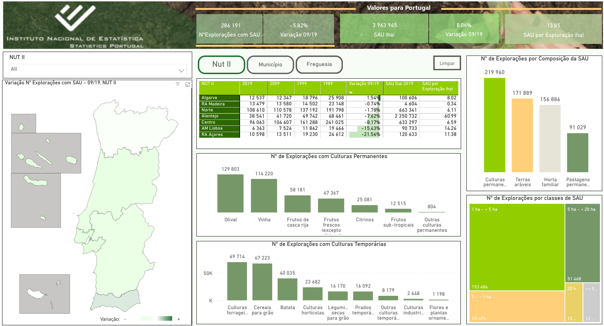

# Data Management and Storage

# Exercise 17 - SQL practice

The goal of this exercise is to practice SQL queries. We will use the INE 
dashboard of Agricultural Census database as a motivation for the queries to 
be performed.

> Your solutions for this exercise should be submitted via Moodle You should save all SQL queries in one SQL script to be submitted. The deadline for submissions is **19th December 2025**.

## Introduction

Through our course, we have used data from the 2019 Agricultural Census to build
a normalized database. In order to access data in the database, we need to 
perform queries, that can be written in many different forms, adjusted to the 
type of result set we want to obtain.

In this exercise, we will use the INE dashboard as a motivation for the query building,
to obtain tables with the data needed to build its charts. Please note that it
will be normal that we don't achieve to the same numbers in our queries, as the
database we built does not contains all of the data of the Agricultural Census 2019.

[]((https://www.ine.pt/scripts/db_ra_2019.html))


Figure 1. Dashboard of Agricultural Census 2019, available at [INE web page](https://www.ine.pt/scripts/db_ra_2019.html)


## Preparation of the exercise

This exercise should be done in DBeaver, so that you can observe in the status bar 
the time of execution of the query. We will use the 
database dms_INE version 2 that resulted from [Exercise 13](https://github.com/isa-ulisboa/greends-dms-exercises/blob/main/dms_ex_13_normalization.md). You can obtain the 
dump of that from the file `dms_INE_v2.sql.zip`, which can be downloaded from the 
data folder of this github repository.

The ER diagram of the database is the following:


## 1. Values for Portugal

## 1.1. Total area of agricultural land

We will obtain the total area of agricultural land (SAU) for Portugal. We will assume that this is the sum of the area with temporary crops and permanent crops. As this
is the total for Portugal, we will consider the sum of regions at NUTS1 level.

We will first need to remember how region levels are described. That is done at
the table `region_level`:

```SQL
-- need to define which region level to use 
SELECT * FROM region_level rl;
```

Now, we do a query for temporary crops:

```SQL
    -- area sum for temporary crops. We need to make joins to region_level, through region
SELECT
    SUM(area)
FROM
    temporary_crop tc
INNER JOIN region r ON
    tc.NutsID = r.NutsID
INNER JOIN region_level rl ON
    r.level_ID = rl.level_ID
WHERE
    tc.year = 2019
    AND rl.region_level = 'NUTS1'
```

And repeat for permanent crops:

Complete the SQL statement:

```SQL
    -- area sum for permanent crops. We need to make joins to region_level, through region
SELECT ... 
   
```
After getting the area for each of crop types, we can obtain the total summing 
the results of both queries. We can achieve this also with a SELECT query:

```SQL
SELECT
	(
(
	SELECT
		-- area sum for temporary crops. We need to make joins to region_level, through region
		SUM(area)
	FROM
		temporary_crop tc
	INNER JOIN region r ON
		tc.NutsID = r.NutsID
	INNER JOIN region_level rl ON
		r.level_ID = rl.level_ID
	WHERE
		tc.year = 2019
		AND rl.region_level = 'NUTS1') +
(
	SELECT
		-- area sum for permanent crops. We need to make joins to region_level, through region
		SUM(area)
	FROM
		permanent_crop pc
	INNER JOIN region r ON
		pc.NutsID = r.NutsID
	INNER JOIN region_level rl ON
		r.level_ID = rl.level_ID
	WHERE
		pc.year = 2019
		AND rl.region_level = 'NUTS1')) as total;
```

## 1.2. Variation between 2009 and 2019

The next value in the dashboard is the percentage of variation between 2009 and 2019.
Therefore, we need to determine the area values for each of these years. As before,
we start with the simpler query, and then combine them to obtain the full result.

Start by running the query for temporary crops, but grouping by year:
```SQL
	SELECT
		tc.year, SUM(area) as area
	FROM
		temporary_crop tc
	INNER JOIN region r ON
		tc.NutsID = r.NutsID
	INNER JOIN region_level rl ON
		r.level_ID = rl.level_ID
	WHERE
		tc.year >= 2009
		AND rl.region_level = 'NUTS1'
		GROUP BY tc.`year`
```
The result is:
| year | area |
|------|------|
|2009	|1896939|
|2019	|1776769|

Repeat the query, but for permanent crops:
```SQL
SELECT ... 
```

The result should be

| year | area |
|------|------|
|2009	|1381448|
|2019	|1721326|

As the result set has the same structure, we can combine both results using `UNION`:
```SQL
/* Obtain the variation of the area in percentage between 2009 and 2019.
 */
SELECT
	year,
	sum(area) as total_area
from
	(
	SELECT
		-- area sum for temporary crops. We need to make joins to region_level, through region
		tc.year,
		SUM(area) as area
	FROM
		temporary_crop tc
	INNER JOIN region r ON
		tc.NutsID = r.NutsID
	INNER JOIN region_level rl ON
		r.level_ID = rl.level_ID
	WHERE
		tc.year >= 2009
		AND rl.region_level = 'NUTS1'
	GROUP BY
		tc.`year`
UNION
	SELECT
		-- area sum for temporary crops. We need to make joins to region_level, through region
		pc.year,
		SUM(area) as area
	FROM
		permanent_crop pc
	INNER JOIN region r ON
		pc.NutsID = r.NutsID
	INNER JOIN region_level rl ON
		r.level_ID = rl.level_ID
	WHERE
		pc.year >= 2009
		AND rl.region_level = 'NUTS1'
	GROUP BY
		pc.`year`
	) as combined
GROUP BY
	year;
```

The result is 
| year | area |
|------|------|
|2009	|3278387|
|2019	|3498095|

Calculate the difference and divide it for the value of 2009 to obtain the value of 6.7% of increase of the area. 

## 1.3. Average agricultural area per farm

Create a query to determine the average area per farm (column `holdings`).

If you have difficulties, check a working query in the solution file `dms_ex_17.sql` 
on folder `script`. 


# 2. Calculate the number of permanent crops

The central bar charts have the number of farms per type of crop (permanent or 
temporary). Which tables do we need to use?

```SQL
-- See how to identify permanent crops
SELECT * FROM permanent_crop_name pcn ;

-- See how to determine the number of farms
SELECT * FROM permanent_crop pc ;
```

We will build our query at country level, for permanent crops. Our results should
be on descending order of the number of farms:
```SQL
-- calculate at country level
SELECT
	pcn.crop_name , r.region_name, SUM(pc.`hold`) as number_farms 
FROM
	permanent_crop pc
INNER JOIN region r ON
	pc.NutsID = r.NutsID
INNER JOIN region_level rl ON
	r.level_ID = rl.level_ID 
INNER JOIN permanent_crop_name pcn ON pc.pc_name_ID = pcn.pc_name_ID 
WHERE pcn.crop_name <> 'Total' AND rl.region_level = 'country' AND pc.year = 2019
GROUP BY r.region_name, pcn.crop_name  
ORDER BY number_farms DESC;
```
Now, repeat for temporary crops:
```SQL
SELECT ...
```

> # 3. Submission of exercise
> **Submit one file**:
> 1. Save the SQL script you created will all queries from this exercise and submit it to Moodle at [Exercise 17 submission](https://elearning.ulisboa.pt/mod/assign/view.php?id=541527).

